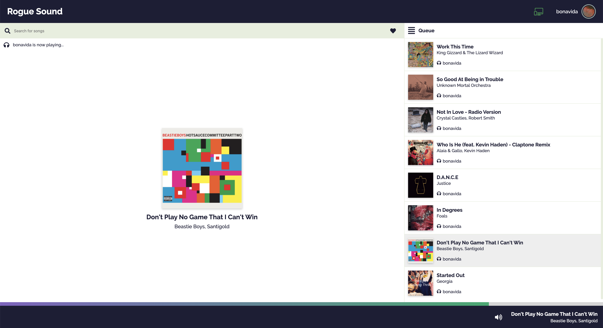

# Rogue Sound


Rogue Sound is a social music sharing website where you can play music with friends and listen to it in real time thanks to the Spotify API.



## Features

- Connect with your Spotify account, no login / registration needed (Spotify Premium required).
- Listen to music synchronized together with everyone else in the room.
- Search songs directly in the Spotify library to be added to the room queue.
- Choose the playback device directly from the browser, all Spotify available devices supported.

## Core Team
 
<table>
  <tr>
    <td align="center"><a href="https://github.com/jmolla31"><br /><sub><b>jmolla31</b></sub></a></td>
    <td align="center"><a href="https://github.com/pabravil"><br /><sub><b>pabravil</b></sub></a></td>
    <td align="center"><a href="https://github.com/bonavida"><br /><sub><b>bonavida</b></sub></a></td>
    <td align="center"><a href="https://github.com/cesarandex"><br /><sub><b>cesarandex</b></sub></a></td>
    <td align="center"><a href="https://github.com/MateoBeMo"><br /><sub><b>MateoBeMo</b></sub></a></td>
  </tr>
</table>

## Contributing

If you want to contribute to this project, please follow the [frontend development guidelines](https://github.com/rogue-sound/development-guidelines/blob/master/FRONTEND_DEVELOPMENT_GUIDELINES.md).

---

## Local development

### Requirements

- node 12.xx.x
- npm 6.x.x

### Installation

First of all, clone the repository:

```bash
git clone https://github.com/rogue-sound/rogue-sound-web.git
```

And install all the dependencies:

```bash
cd rogue-sound-web
npm install
```

### Running the app on localhost

In order to make the application work, you need a `.env` file in the root directory with the following format:

```
CLIENT_ID=XXXXXXXXXXXXXXXXXXXXXXXXXX
REDIRECT_URI=http://localhost:8080
```

where `CLIENT_ID` is the id of your registered application in the [Spotify for Developers web](https://developer.spotify.com/dashboard) and `REDIRECT_URI` is the url that Spotify will use to redirect after the authentication.

To run the app in dev mode with hot-reloader, run the following command:

```bash
npm start
```

and now you only need to visit http://localhost:8080 in your browser of choice.

### About i18n

We are using [react-intl](https://github.com/formatjs/react-intl) for internationalization. Follow the next steps to include translations in the application.

1. Create a `messages.js` file inside the same folder where the React component is.
2. Import defineMessages from `react-intl` and define the translations only in the default language. For example:
    ```js
    import { defineMessages } from 'react-intl';

    export default defineMessages({
      LoginButton: {
        id: 'app.Layout.Header.LoginButton',
        defaultMessage: 'Login to Spotify',
      },
      LogoutButton: {
        id: 'app.Layout.Header.LogoutButton',
        defaultMessage: 'Logout',
      }
    });
    ```
3. Run the following command in the console:
    ```bash
    npm run build:i18n
    ```
4. This will generate (or update) two files inside `src/i18n`: `en.json` and `es.json`. If you look into the default language json file (`en.json`), you will see something like this:
    ```json
    {
      "app.Layout.Header.LoginButton": "Login to Spotify",
      "app.Layout.Header.LogoutButton": "Logout"
    }
    ```
5. If you look at the other language json file (`es.json`), you will see something like this:
    ```json
    {
      "app.Layout.Header.LoginButton": "",
      "app.Layout.Header.LogoutButton": ""
    }
    ```
    You only need to fill the translations.

6. And finally, in order to use these translations inside a React component, you need to use the `useIntl` hook. For example:
    ```jsx
    import { useIntl } from 'react-intl';

    const LoginButton = () => {
      const intl = useIntl();

      return (
        <button>
          {intl.formatMessage({
            id: 'app.Layout.Header.LoginButton',
          })}
        </button>
      );
    };

    export default LoginButton;
    ```

## Building the app

You can create a development build:

```
npm run build:dev
```

and a production build:

```
npm run build:prod
```

The built files are placed in a `/dist` folder at the root directory.

If you want to serve these static files in local, one quick option could be to use [serve](https://github.com/zeit/serve).

```bash
npm install -g serve
serve ./dist
```

and then go to http://localhost:5000.